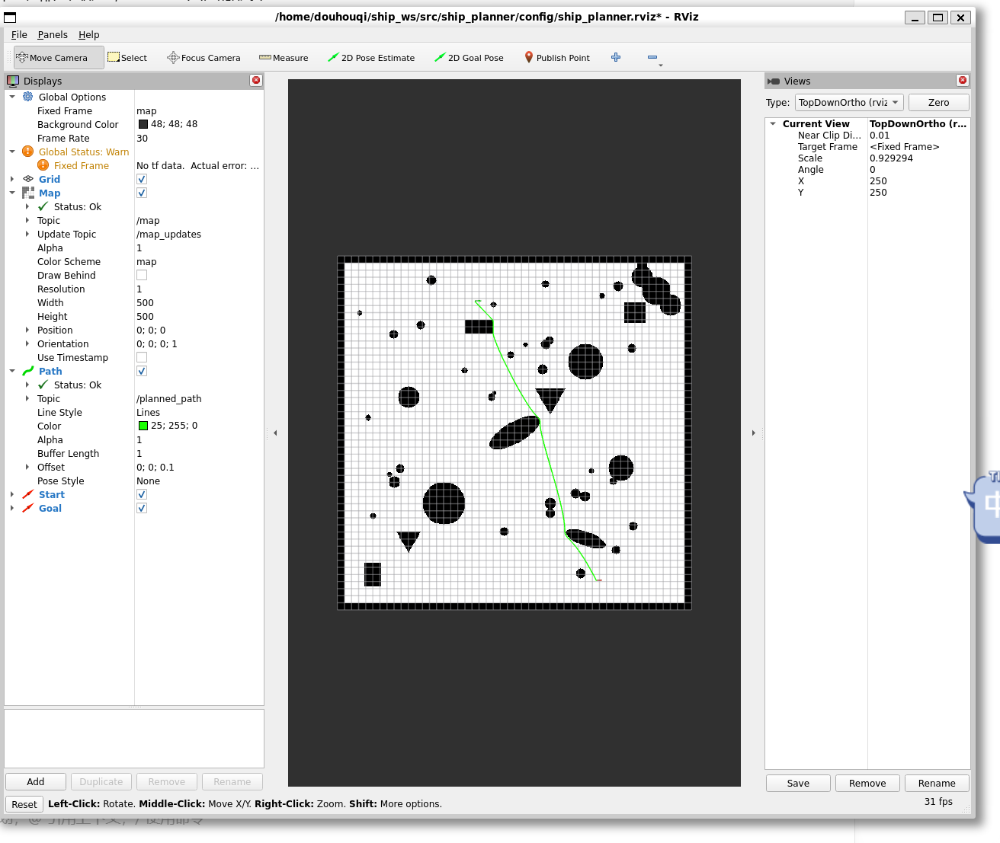

# Ship Planner - 船舶自动驾驶路径规划仿真系统

基于 ROS 2 Humble 的船舶自动驾驶路径规划仿真系统，实现从地图构建、路径规划、动态避障到可视化验证的完整流程。



## 项目概述

本项目面向船舶自动驾驶场景，在二维占据栅格地图上实现 A* 全局路径规划算法，集成路径简化、转向半径约束和平滑处理，支持动态障碍物的实时检测与自动重规划，最终输出符合船舶动力学约束的安全航行路径。

### 核心功能

- **多形状障碍物地图生成**：支持圆形、矩形、椭圆、三角形、L形、随机礁石等多种几何形状
- **A*全局路径规划**：8 方向搜索 + 欧几里得距离启发函数，支持无效起终点自动修正
- **路径后处理管线**：Douglas-Peucker 简化 → 转向半径约束（贝塞尔弧线插值）→ 迭代平滑
- **动态障碍物模拟**：航线前方随机生成移动障碍物，模拟其他船只/漂浮物
- **动态避障重规划**：实时检测路径安全，被阻断时自动从船舶当前位置重规划绕行
- **船舶运动模拟**：沿规划路径匀速航行，实时发布位姿与 TF 变换
- **RViz2 可视化**：显示静态地图、规划路径、起点/终点标记、船舶实时位姿、动态障碍物

## 系统架构

```
      ┌──────────────────┐                        ┌─────────────────────┐
      │  Map Generator   │──.pgm + .yaml─────────►│  Simple Map Server   │
      │ (map_generator)  │                        │ (simple_map_server)  │
      └──────────────────┘                        └──────────┬──────────┘
                                                             │ /map
                                                  ┌──────────▼──────────┐
      ┌─────────────────────┐    /dynamic_        │   Path Planner      │
      │ Obstacle Detector   │─── obstacles ──────►│ (path_planner_node)  │
      │ (obstacle_detector) │                     │  A* + 动态重规划     │
      └─────────────────────┘                     └──────────┬──────────┘
                                                   /planned_path│
                                                  ┌──────────▼──────────┐
                                                  │   Ship Simulator    │
                                                  │  (ship_simulator)    │
                                                  └──────────┬──────────┘
                                                   /ship_pose│
                                                  ┌──────────▼──────────┐
                                                  │       RViz2         │
                                                  │   (可视化展示)       │
                                                  └─────────────────────┘
```

## 项目结构

```
ship_planner/
├── ship_planner/
│   ├── path_planner_node.py    # 核心路径规划节点（A* + 简化 + 平滑 + 动态重规划）
│   ├── simple_map_server.py    # 轻量级地图服务器
│   ├── map_generator.py        # 多形状障碍物地图生成器
│   ├── obstacle_detector.py    # 动态障碍物模拟器
│   ├── ship_simulator.py       # 船舶运动模拟器
│   └── launch_ship_planner.py  # 系统启动文件
├── config/
│   └── ship_planner.rviz       # RViz2 可视化配置
├── resource/
│   └── ship_planner            # 包资源标识
├── test/                       # 单元测试
├── package.xml                 # 包描述文件
├── setup.py                    # Python 入口配置
├── setup.cfg                   # 构建配置
└── demo.png                    # 仿真效果截图
```

## 节点说明

| 节点 | 可执行文件 | 功能 |
|------|-----------|------|
| `map_server` | `simple_map_server` | 读取 .pgm + .yaml 地图，发布 OccupancyGrid 到 `/map` |
| `path_planner_node` | `path_planner` | 接收起终点，A* 规划 + 路径后处理，动态障碍物重规划 |
| `obstacle_detector` | `obstacle_detector` | 模拟动态障碍物，航线前方随机生成，自动过期清理 |
| `ship_simulator` | `ship_simulator` | 沿路径匀速航行，发布船舶位姿与 TF |

## 环境要求

- **操作系统**: Ubuntu 22.04 (WSL2 兼容)
- **ROS 2 版本**: Humble Hawksbill
- **Python**: 3.10+
- **ROS 依赖**: `rclpy`, `nav_msgs`, `geometry_msgs`, `sensor_msgs`, `std_msgs`, `tf2_ros`, `visualization_msgs`
- **Python 依赖**: `numpy`, `Pillow`, `PyYAML`, `matplotlib`

## 快速开始

### 1. 生成地图

```bash
cd ~/ship_ws
python3 src/ship_planner/ship_planner/map_generator.py
```

地图文件将保存到 `~/ship_ws/maps/` 目录（500m × 500m，分辨率 1m/pixel）。

### 2. 构建项目

```bash
cd ~/ship_ws
colcon build --packages-select ship_planner
source install/setup.bash
```

### 3. 一键启动

```bash
ros2 launch ship_planner launch_ship_planner.py
```

### 4. 设置起点和终点

在 RViz2 中：
- 点击 **2D Pose Estimate**（顶部工具栏）设置船舶起点
- 点击 **2D Goal Pose**（顶部工具栏）设置目标终点
- 绿色路径自动显示，黄色箭头船舶沿路径航行

### 5. 自定义参数（可选）

```bash
# 指定地图文件路径
ros2 launch ship_planner launch_ship_planner.py map:=/path/to/your/map.yaml

# 关闭动态避障（静态规划模式）
ros2 launch ship_planner launch_ship_planner.py \
    enable_dynamic_replanning:=false \
    enabled:=false
```

## 可配置参数

### 路径规划器（path_planner_node）

| 参数 | 默认值 | 说明 |
|------|--------|------|
| `enable_dynamic_replanning` | `true` | 是否启用动态避障重规划 |
| `replan_check_interval` | `2.0` | 重规划检查间隔（秒） |
| `replan_safety_distance` | `8.0` | 路径安全距离阈值（米） |
| `smooth_path` | `true` | 是否启用路径平滑 |
| `verbose_planner` | `false` | A* 调试日志开关 |

### 动态障碍物（obstacle_detector）

| 参数 | 默认值 | 说明 |
|------|--------|------|
| `spawn_interval` | `8.0` | 障碍物生成间隔（秒） |
| `obstacle_radius` | `12.0` | 障碍物半径（米） |
| `obstacle_lifetime` | `30.0` | 障碍物存活时间（秒） |
| `max_obstacles` | `5` | 同时存在的最大障碍物数 |
| `enabled` | `true` | 是否启用动态障碍物 |

### 船舶模拟器（ship_simulator）

| 参数 | 默认值 | 说明 |
|------|--------|------|
| `speed` | `5.0` | 航行速度（m/s） |
| `update_rate` | `20.0` | 位姿发布频率（Hz） |
| `loop_mode` | `false` | 是否循环航行 |

## 算法详解

### A* 路径规划

采用 8 方向（含对角线）网格搜索，启发函数为欧几里得距离：

```
f(n) = g(n) + h(n)
g(n) = 从起点到当前节点的实际代价
h(n) = 当前节点到终点的直线距离（可采纳启发函数）
```

对角线移动代价为 1.414，正交移动代价为 1.0，确保路径更贴近真实最短距离。

### 路径后处理管线

```
原始 A* 路径
  │
  ▼ Douglas-Peucker 简化 + Bresenham 碰撞检测
  │  （移除冗余航点，确保简化后不穿过障碍物）
  │
  ▼ 转向半径约束 + 贝塞尔弧线插值
  │  （急弯处插入平滑弧线段，默认最小半径 15m）
  │
  ▼ 迭代平均法平滑
  │  （减少路径抖动，保持安全距离）
  │
  ▼ 最终路径 → 发布到 /planned_path
```

### 动态避障机制

```
船舶沿路径航行中...
  │
  ├─ obstacle_detector 在航线前方 50~150m 生成随机障碍物
  │   └─ 发布 /dynamic_obstacles（PoseArray）
  │
  ├─ path_planner 收到障碍物 → 叠加到栅格地图
  │   └─ 每 2s 检查当前路径安全性
  │
  ├─ 检测到路径被阻断  ────►  自动重规划
  │   使用船舶当前位置为新起点，终点不变
  │   发布新路径到 /planned_path
  │
  ├─ ship_simulator 收到新路径 → 自动切换跟随
  │
  └─ 障碍物 30s 后自动过期消失
```

## 话题接口

| 话题 | 类型 | 方向 | 说明 |
|------|------|------|------|
| `/map` | `OccupancyGrid` | 订阅 | 静态占据栅格地图 |
| `/initialpose` | `PoseWithCovarianceStamped` | 订阅 | 起点（RViz2 2D Pose Estimate） |
| `/goal_pose` | `PoseStamped` | 订阅 | 终点（RViz2 2D Goal Pose） |
| `/planned_path` | `Path` | 发布 | 规划路径 |
| `/dynamic_obstacles` | `PoseArray` | 发布 | 动态障碍物（orientation.w=半径） |
| `/dynamic_obstacles_markers` | `MarkerArray` | 发布 | 动态障碍物 RViz2 可视化标记 |
| `/ship_pose` | `PoseStamped` | 发布 | 船舶当前位姿 |

## 地图障碍物类型

| 形状 | 数量 | 模拟场景 |
|------|------|----------|
| 圆形岛屿 | 6 | 岛屿 |
| 随机小礁石 | 30 | 礁石群 |
| 矩形 | 3 | 码头、人工岛 |
| 椭圆 | 2 | 狭长岛屿 |
| 三角形 | 2 | 礁石群 |
| L形 | 1 | 防波堤、半岛 |
| 右下角岛群 | 3 | 群岛 |
| 地图边界 | 10m宽 | 水域边界 |

## RViz2 可视化说明

| 显示项 | 颜色 | 话题 |
|--------|------|------|
| 占据栅格地图 | 灰/黑 | `/map` |
| 规划路径 | 绿色线条 | `/planned_path` |
| 起点标记 | 红色箭头 | `/current_start` |
| 终点标记 | 绿色箭头 | `/current_goal` |
| 船舶实时位姿 | 黄色箭头 | `/ship_pose` |
| 动态障碍物 | 橙色圆柱体 | `/dynamic_obstacles_markers` |

## 常见问题

### RViz2 显示 OpenGL 错误
WSL2 图形驱动兼容性问题，可设置环境变量：
```bash
export LIBGL_ALWAYS_SOFTWARE=1
```

### RViz2 窗口无法点击
按 F11 切换全屏模式可解决焦点问题。

### 路径穿过障碍物
路径简化算法已加入 Bresenham 碰撞检测，确保简化后的路径不穿过障碍物。

### 动态障碍物不消失
使用 `Marker.DELETEALL` 机制确保过期障碍物在 RViz2 中同步清除。如仍有残留，重启 RViz2 即可。

### 到达终点后仍在规划
路径规划器会自动检测船舶距终点距离 < 5m 时停止重规划，避免无效规划循环。

## 许可证

Apache-2.0

## 作者

douhouqi
